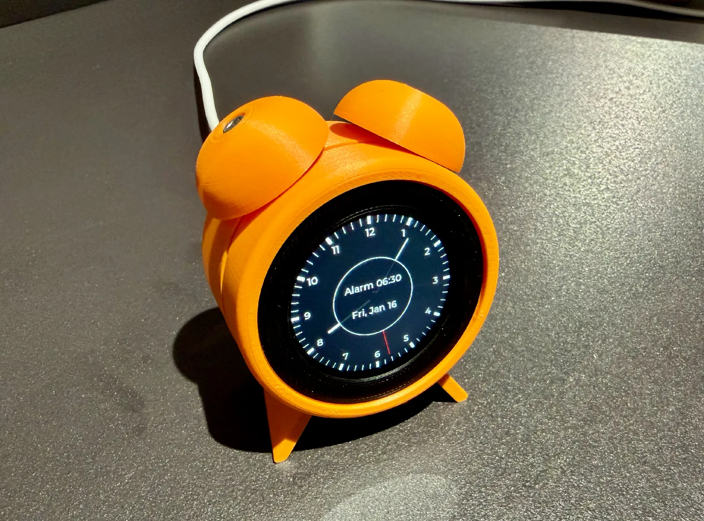

# M5Stack Dial Alarm Clock

This repository is a fork of [tomwilkie/clock](https://github.com/tomwilkie/clock) with a much more complete alarm-clock workflow built on top of the original analogue M5Stack Dial clock idea.

The base project turns an `M5Stack Dial` into a round bedside clock for Home Assistant. This fork keeps that core idea, but adds on-device alarm logic, snoozing, next-alarm overrides, weekday/weekend scheduling, Home Assistant controls, and optional music playback through a Home Assistant media player.



## What This Fork Adds

Compared to the original project, this fork adds:

- A real on-device alarm that triggers when the configured alarm time is reached
- Weekday and weekend default alarm times
- A one-time "next ring" override using the rotary dial
- Snooze support, including adjustable snooze duration while the alarm is ringing
- Skip-next-ring behavior from the center touch target
- `Alarm Enabled`, `Stop Alarm`, and `Test Alarm` entities in Home Assistant
- `Next Alarm Time` exported as a timestamp-style text sensor for automations
- On-screen alarm state UI with different colors for:
  - armed
  - skipped
  - disabled
  - snoozed
  - ringing
  - recently dismissed
- Side-by-side on-screen `Snooze` and `Stop` controls while ringing
- Idle screen dimming with brighter alarm-time behavior
- Optional external alarm audio through Home Assistant / Music Assistant / Chromecast
- More robust boot handling for current ESPHome versions

## Current Behavior

The device currently works like this:

- The screen shows an analogue clock face on the M5Stack Dial display.
- The RTC (`PCF8563`) is used locally, with SNTP syncing time back into the RTC.
- The rotary encoder adjusts the next upcoming alarm.
- Slow rotation changes by `1 minute`, faster rotation by `5 minutes`, very fast rotation by `15 minutes`.
- During ringing, the rotary encoder adjusts snooze duration instead.
- While snoozed, encoder alarm-time edits are locked.
- Tapping the center area toggles `skip next ring`.
- The single hardware button:
  - short press while ringing = snooze 5 minutes
  - hold for 3 seconds while ringing or snoozed = dismiss the alarm
- If Home Assistant is configured, the alarm can also start music playback on a speaker and stop it on snooze/dismiss.

## Alarm Model

This fork uses a simple model:

- `Weekday Alarm Time` is the default for Monday-Friday
- `Weekend Alarm Time` is the default for Saturday-Sunday
- Turning the dial does **not** rewrite those defaults directly
- Turning the dial creates a one-time override for the **next actual ring**
- After that ring happens, the override is cleared automatically

This makes the device easy to use at the bedside:

- keep stable weekday/weekend defaults
- quickly tweak only tomorrow's alarm from the dial

## Home Assistant Entities

The ESPHome config exposes the following useful entities:

- `Alarm Enabled`
- `Weekday Alarm Time`
- `Weekend Alarm Time`
- `Stop Alarm`
- `Test Alarm`
- `Next Alarm Time`

`Next Alarm Time` is published as an ISO-style local timestamp string and marked with `device_class: timestamp`, which makes it useful in Home Assistant automations.

## Optional Music Alarm

This repo supports starting alarm audio through Home Assistant when the alarm begins.

The current ESPHome config expects:

- a Home Assistant script named `script.alarmv1_start_alarm_audio`
- a Home Assistant media player entity configured in `clock.yaml` under:

```yaml
substitutions:
  alarm_audio_player_entity: media_player.living_room_speaker_2
```

When the alarm starts:

- the device triggers `script.alarmv1_start_alarm_audio`
- once Home Assistant confirms success, the local buzzer is stopped

When the alarm is snoozed, stopped, disabled, or times out:

- the device calls `media_player.media_stop` for the configured player

### Example Home Assistant Script

This is an example script that works with Music Assistant:

```yaml
alias: AlarmV1 Start Alarm Audio
sequence:
  - action: media_player.volume_set
    target:
      entity_id: media_player.living_room_speaker_2
    data:
      volume_level: 0.8

  - action: music_assistant.play_media
    target:
      entity_id: media_player.living_room_speaker_2
    data:
      media_id: Techno
      media_type: playlist
      enqueue: replace

  - delay: 1s

  - action: media_player.shuffle_set
    target:
      entity_id: media_player.living_room_speaker_2
    data:
      shuffle: true
```

You must also enable ESPHome devices to perform Home Assistant actions in the ESPHome integration settings.

## Optional Morning Briefing

When the alarm is dismissed/stopped, the device can call a Home Assistant script to speak a morning briefing on the same speaker.

The ESPHome config expects:

```yaml
substitutions:
  morning_briefing_action: script.alarmv1_morning_briefing
  morning_briefing_player_entity: media_player.living_room_speaker_2
```

A starter Home Assistant package is included at:

```text
home-assistant/packages/alarmv1_morning_briefing.yaml.example
```

It fetches detailed weather on demand with `weather.get_forecasts` and announces:

- current condition and temperature
- today's high and low
- whether rain is expected soon, including approximate time/probability when available
- commute duration only on weekday mornings while Gurgen is home

Commute lookup is intentionally not a polling sensor. Run the local route service and let the HA package call it only from the briefing script:

```sh
python3 home-assistant/scripts/yandex_route_service.py \
  --host 127.0.0.1 \
  --port 8765 \
  --route-url 'https://yandex.com/maps/?rtext=40.177628%2C44.512546~40.184530%2C44.501020&rtt=auto'
```

Quick one-shot verification:

```sh
python3 home-assistant/scripts/yandex_route_service.py --once
```

Copy the package into Home Assistant, ensure the route service is reachable from HA at `http://127.0.0.1:8765/route` or adjust the `rest_command` URL, and expose `script.alarmv1_morning_briefing` before daily use.

## Hardware

This project is built for:

- [M5Stack Dial](https://docs.m5stack.com/en/core/M5Dial)

Useful extras from the original project:

- 3D printed parts: https://www.printables.com/model/1562621-analogue-alarm-clock-for-home-assistant
- low-profile USB-C cable: https://www.amazon.co.uk/dp/B0FMPVZJDP

## Project Files

- [clock.yaml](/Users/gdavtyan/Projects/esp-alarm-clock/clock.yaml): main ESPHome firmware config
- [debug.yaml](/Users/gdavtyan/Projects/esp-alarm-clock/debug.yaml): older/shared debug config kept in the repo
- [clock.webp](/Users/gdavtyan/Projects/esp-alarm-clock/clock.webp): device photo

## Configuration Notes

Before flashing, you will probably want to adjust:

- device name and friendly name
- Wi-Fi credentials in `secrets.yaml`
- timezone via `timezone`
- `alarm_audio_player_entity`
- Home Assistant action/entity substitutions:
  - `alarm_audio_start_action`
  - `alarm_audio_stop_action`
  - `home_lights_off_action`
  - `home_lights_off_entity`

This repo is currently tailored to:

- `Asia/Yerevan`
- Home Assistant
- Music Assistant
- a Chromecast-style media player

## Installing ESPHome on macOS

```sh
brew install pipx libmagic cairo
pipx install esphome
pipx runpip esphome install python-magic pillow==11.3.0 cairosvg
```

## Flashing

First flash over USB:

```sh
~/.local/bin/esphome run --device=/dev/tty.usbmodemXXXX clock.yaml
```

Later flashes over Wi-Fi:

```sh
~/.local/bin/esphome run clock.yaml
```

## Notes

- The M5Stack Dial only has one normal user-facing hardware button.
- The touchscreen can occasionally log `Failed to read status`; in this project that has mostly been harmless noise unless touch behavior is obviously broken.
- The current config uses the modern `mipi_spi` display driver because it is more stable with recent ESPHome versions than the older `ili9xxx` setup.
