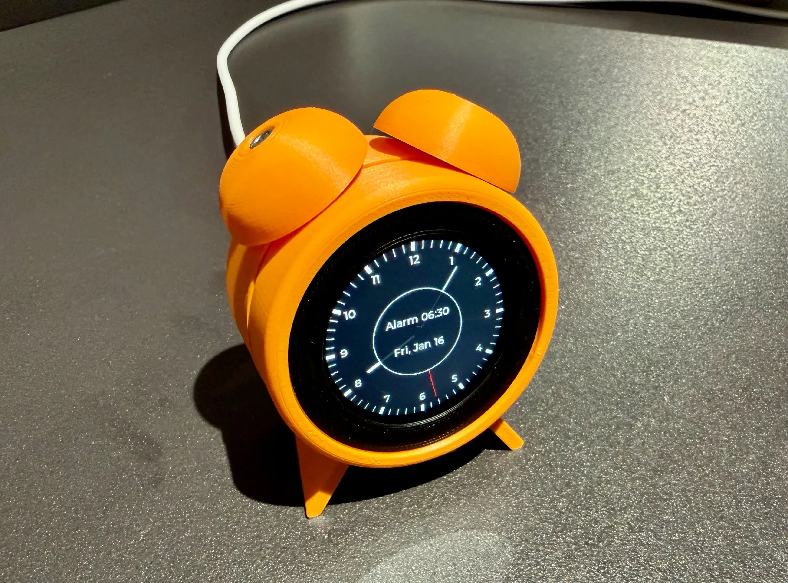

# M5Stack Dial Alarm Clock

A full-screen digital bedside alarm clock for the [M5Stack Dial](https://docs.m5stack.com/en/core/M5Dial), built with ESPHome, LVGL, and Home Assistant.

This repository started as a fork of [tomwilkie/clock](https://github.com/tomwilkie/clock), but it is now a much more complete alarm-clock workflow: on-device alarm scheduling, snooze, skip/away states, Home Assistant actions, morning briefing prompts, and a media-control screen for music playback.



## Current Design Direction

The current UI is a clean, full-screen digital clock inspired by simple reference-photo style clock faces:

- Large centered 24-hour time
- Dark background with warm peach clock text
- Thin divider and compact status pill
- Next-ring text and optional countdown under the time
- Cyan/teal state accents
- Full-screen cyan/teal Away Mode instead of a small disabled indicator
- No persistent bottom navigation
- Overlay-style Home, Alarm, Morning Briefing, and Music screens only when needed
- Hanken Grotesk for the main clock/menu/alarm UI
- DejaVu Sans for media metadata, because it includes broader glyph coverage such as Cyrillic track titles

The UI intentionally avoids runtime album art. The media screen uses text, icon controls, and a progress/volume arc to keep flash/RAM risk low.

## Feature Overview

### Alarm scheduling

- Weekday and weekend default alarm times exposed as Home Assistant time controls
- On-device calculation of the next actual ring time
- `Next Alarm Time` exported as a timestamp-style Home Assistant text sensor
- One-time next-ring override using the rotary encoder
- One-time override clears automatically after the ring happens
- Skip-next-ring behavior for intentionally skipping only the next occurrence
- Away Mode by disabling the alarm, with a full-screen cyan/teal visual state
- State survives reboot where appropriate:
  - alarm enabled/disabled
  - skip-next-ring target
  - snooze duration
  - one-time override target

### Ringing behavior

- Local buzzer alarm pattern as a fallback/default
- Optional Home Assistant alarm audio start action
- If Home Assistant audio starts successfully, the local buzzer is stopped
- Snooze and dismiss both stop Home Assistant alarm audio
- Alarm auto-times-out after 5 minutes if not handled
- Ringing screen replaces the clock with large `Snooze` and `STOP` controls
- Ringing screen includes a plain text hint: `Turn knob for snooze`
- Display brightness is forced active while ringing

### Snooze

- Short hardware-button press while ringing snoozes for 5 minutes
- On-screen `Snooze` button uses the current adjustable snooze duration
- Rotary encoder adjusts snooze duration while the alarm is ringing
- Snooze duration is clamped between 5 and 60 minutes
- While snoozed, the main clock shows the snooze-until time
- While snoozed, rotary turns adjust the active snooze target rather than changing tomorrow's normal alarm
- Snooze target is bounded so it cannot move into the past and is kept within a short wake-up window

### Dismiss and morning flow

- Stop/dismiss clears snooze, stops local buzzer, and stops Home Assistant alarm audio
- After a deliberate stop/dismiss, the UI shows a large Morning prompt
- Morning prompt auto-starts the briefing after about 15 seconds
- Morning prompt stays available for about 60 seconds
- Morning prompt options:
  - `Briefing`
  - `Brief+Music`
  - `Dismiss`
- Briefing is delegated to a Home Assistant script so weather, commute, calendar, news, or TTS behavior can live in Home Assistant
- `Brief+Music` sends `play_music_after: "true"` to the briefing script
- The prompt can be dismissed without starting anything

### Home menu

The Home menu is an overlay, not a bottom nav.

- Opened by a center long-press or short hardware-button press when idle
- Auto-closes after 10 seconds
- `All Off` button calls a configurable Home Assistant action/entity pair
- State-aware music button:
  - `Start Music` when idle
  - `Open Music` when already playing
  - `Resume Music` when paused
  - `Starting...` while the Home Assistant music start is pending
- Close button returns to the clock

### Music and media controls

The Music screen is an on-device controller for a configured Home Assistant media player.

- Starts morning/music playback through the configured Home Assistant briefing action using `music_only: "true"`
- Sends immediate and delayed `media_player.media_play` nudges after starting music
- Shows playback state:
  - `READY`
  - `STARTING`
  - `NOW PLAYING`
  - `PAUSED`
- Shows media title, artist, or album from Home Assistant media-player attributes
- Keeps DejaVu Sans for media text to support broader track-title glyphs
- Rotary encoder controls media volume while the media screen is open
- Volume changes are sent to Home Assistant with `media_player.volume_set`
- Arc shows volume briefly after rotary changes
- Arc otherwise shows track progress when media position/duration are available
- Center play/pause button calls `media_player.media_play_pause`
- Stop button closes the media screen and stops/cancels pending morning music
- Stop action cancels both sides:
  - stops the local pending ESPHome music-start script
  - calls `script.turn_off` for the configured briefing/music script
  - calls `media_player.media_stop` for the configured player
- Next button behavior:
  - single tap = `media_player.media_next_track`
  - double tap = request next morning-music playlist with `skip_playlist: "true"`
- Long-press on Stop cycles a media sleep timer:
  - off
  - 15 minutes
  - 30 minutes
  - 60 minutes
- Sleep timer stops the media player when it expires

### Idle, brightness, and night behavior

- Display dims after about 60 seconds of inactivity
- Day idle brightness is lower than active brightness
- Night active brightness is reduced
- Night idle brightness is very low
- At night, the first tap after dimming only wakes brightness and does not trigger the underlying touch action
- Any real interaction resets the idle timer and restores active brightness

### Touch and button controls

#### Center touch area

- Short tap while idle toggles skip-next-ring
- Short tap while Away Mode is active re-enables the alarm
- Long press opens the Home menu
- Touch debounce prevents accidental repeated taps
- Night wake-only tap protection avoids accidental skip/menu actions when waking the dimmed screen

#### Rotary encoder

- Normal clock screen:
  - clockwise/anticlockwise adjusts the next ring as a one-time override
  - slow turns adjust by 1 minute
  - faster turns adjust by 5 minutes
  - very fast turns adjust by 15 minutes
- Ringing screen:
  - adjusts snooze duration
- Snoozed state:
  - adjusts the active snooze-until time
- Music screen:
  - adjusts media volume in 5% steps

#### Hardware button

- Short press while ringing: snooze 5 minutes
- Long press while ringing or snoozed: dismiss/stop alarm
- Short press while media screen is open: play/pause
- Long press while media screen is open: close media screen and stop music
- Short press while idle: open/close the Home menu
- Long press while idle: run the configured all-lights-off Home Assistant action

### Home Assistant entities

Useful public entities exposed by the ESPHome device:

- `Alarm Enabled` switch
- `Weekday Alarm Time` time control
- `Weekend Alarm Time` time control
- `Next Alarm Time` timestamp-style text sensor
- `Stop Alarm` button
- `Test Alarm` button
- `Backlight` light
- `Button` binary sensor

Internal Home Assistant mirrors used by the media screen:

- media-player state
- media title
- media artist
- media album
- media volume
- media position
- media duration

## Home Assistant Integration Contract

The firmware is intentionally generic. Local/private Home Assistant details should be supplied through substitutions and `secrets.yaml`, not committed directly.

Relevant substitutions in `clock.yaml`:

```yaml
substitutions:
  alarm_audio_player_entity: media_player.example_speaker
  alarm_audio_start_action: script.alarmv1_start_alarm_audio
  alarm_audio_stop_action: media_player.media_stop
  morning_briefing_action: script.alarmv1_morning_briefing
  morning_briefing_player_entity: media_player.example_speaker
  home_lights_off_action: light.turn_off
  home_lights_off_entity: all
  timezone: Etc/UTC
```

### Alarm audio action

When the alarm starts, ESPHome calls:

```yaml
action: ${alarm_audio_start_action}
data:
  entity_id: ${alarm_audio_player_entity}
```

If that succeeds while the alarm is still ringing, the local buzzer is stopped.

When the alarm is snoozed, stopped, disabled, or timed out, ESPHome calls:

```yaml
action: ${alarm_audio_stop_action}
data:
  entity_id: ${alarm_audio_player_entity}
```

### Morning briefing / music action

The morning briefing action should accept:

```yaml
media_player_entity_id: ${morning_briefing_player_entity}
```

Optional flags sent by the device:

```yaml
play_music_after: "true"   # Briefing, then music
music_only: "true"         # Start music only
skip_playlist: "true"      # Choose another music playlist/source
```

The same action can be used for:

- post-dismiss briefing
- briefing then music
- on-demand music from the Home menu
- playlist/source skipping from the Music screen

### All-lights-off action

The Home menu `All Off` button calls:

```yaml
action: ${home_lights_off_action}
data:
  entity_id: ${home_lights_off_entity}
```

## Hardware

Target hardware:

- M5Stack Dial / ESP32-S3
- 240 x 240 round GC9A01A display over `mipi_spi`
- FT5x06 touchscreen
- Rotary encoder
- Front hardware button
- PCF8563 RTC
- Local buzzer output
- Backlight output
- RC522 I2C NFC reader configured in firmware, currently with no documented user-facing behavior

Configured pins in `clock.yaml`:

- I2C SDA: `GPIO11`
- I2C SCL: `GPIO12`
- Buzzer: `GPIO3`
- Backlight: `GPIO9`
- Rotary A: `GPIO40`
- Rotary B: `GPIO41`
- Hardware button: `GPIO42`
- Display MOSI: `GPIO5`
- Display CLK: `GPIO6`
- Display CS: `GPIO7`
- Display reset: `GPIO8`
- Display DC: `GPIO4`
- Touch interrupt: `GPIO14`

Useful extras from the original project:

- 3D printed parts: https://www.printables.com/model/1562621-analogue-alarm-clock-for-home-assistant
- low-profile USB-C cable: https://www.amazon.co.uk/dp/B0FMPVZJDP

## Project Files

- [`clock.yaml`](clock.yaml): main ESPHome firmware config
- [`debug.yaml`](debug.yaml): optional/shared ESPHome diagnostic entities
- [`tests/test_alarmv1_digital_redesign.py`](tests/test_alarmv1_digital_redesign.py): structural tests for the current UI/behavior expectations
- [`clock.webp`](clock.webp): project/device image
- [`assets/`](assets/): fonts used by the LVGL UI

## Configuration Notes

Before flashing, adjust:

- device name and friendly name if needed
- Wi-Fi credentials in `secrets.yaml`
- `timezone`
- `alarm_audio_player_entity`
- `alarm_audio_start_action`
- `alarm_audio_stop_action`
- `morning_briefing_action`
- `morning_briefing_player_entity`
- `home_lights_off_action`
- `home_lights_off_entity`

For public branches and examples, keep private values out of the repository. Use placeholders in `clock.yaml` and keep local secrets/config in untracked files or a private build-preparation step.

## Installing ESPHome on macOS

```sh
brew install pipx libmagic cairo
pipx install esphome
pipx runpip esphome install python-magic pillow==11.3.0 cairosvg
```

## Validation

Run the structural tests:

```sh
pytest
```

Validate the ESPHome config:

```sh
esphome config clock.yaml
```

Compile before flashing behavior/UI changes:

```sh
esphome compile clock.yaml
```

## Flashing

First flash over USB:

```sh
esphome run --device=/dev/tty.usbmodemXXXX clock.yaml
```

Later flashes over Wi-Fi/OTA:

```sh
esphome run clock.yaml
```

If your local environment needs private substitutions or a private `secrets.yaml`, prepare those private files first and flash the prepared copy instead of committing local details to this repo.

## Notes and Pitfalls

- ESPHome devices must be allowed to perform Home Assistant actions in the ESPHome integration settings.
- The M5Stack Dial only has one normal user-facing hardware button, so behavior is context-dependent.
- The touchscreen can occasionally log `Failed to read status`; investigate only if touch behavior is actually broken.
- The current config uses the modern `mipi_spi` display driver because it is more stable with recent ESPHome versions than the older `ili9xxx` setup.
- Avoid runtime album art on this device unless you are ready to validate flash/RAM usage and crash behavior carefully.
- Keep media metadata text glyph-safe; DejaVu Sans is used for broader character support.
